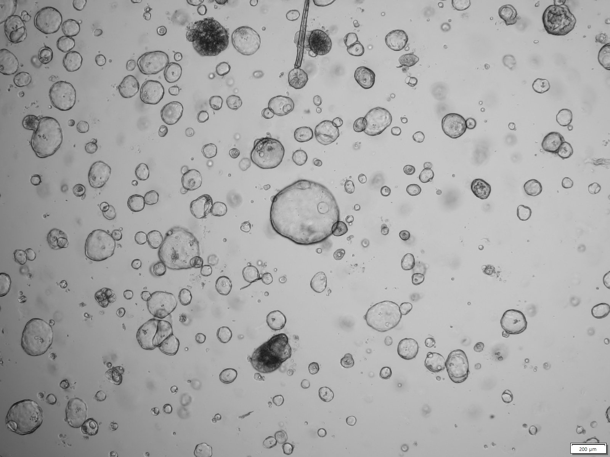
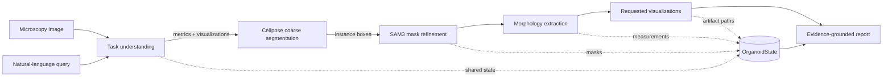

<div align="center">

# MorphoOrgaAgent

### An agentic AI pipeline for query-driven organoid morphology analysis

**Microscopy image + natural-language query → segmentation, measurements, visualizations, and an evidence-grounded report**

🎉 **Our paper has been accepted by The 2nd Agentic AI for Medicine Workshop at MICCAI 2026.**

</div>

<p align="center">
  
</p>

<p align="center"><em>An example bright-field organoid image included with this repository.</em></p>

## Overview

MorphoOrgaAgent is an agentic pipeline for analyzing organoid microscopy images
from natural-language requests. Instead of requiring users to manually select
segmentation, measurement, plotting, and reporting functions, the system maps a
query to an analysis intent and executes a fixed, auditable computer-vision
workflow.

The current implementation combines two language-model-backed agents with
deterministic analysis stages:

1. `TaskUnderstandingAgent` converts the user query into validated metric and
   visualization selections.
2. Cellpose produces a coarse instance mask.
3. SAM3 refines the Cellpose detections using geometric prompts and the text
   prompt `"cell cluster"`.
4. OpenCV-based tools calculate per-organoid morphology measurements.
5. Visualization tools create the requested quality-control and quantitative
   figures.
6. `ReportAgent` synthesizes an evidence-grounded Markdown report from the
   shared pipeline state.

Every stage reads from and writes to a single `OrganoidState`, preserving
artifact paths, measurements, analysis intent, generated figures, and audit
logs in one inspectable record.

## Method



The language models select and summarize analyses, while segmentation,
measurement, and plotting are performed by explicit tools. The report agent is
instructed to use only evidence already present in `OrganoidState`; it does not
rerun analysis or invent unavailable measurements.

## Key features

- **Natural-language task specification** with strict structured-output
  validation and a deterministic keyword-based fallback.
- **Two-stage instance segmentation** using Cellpose (`cyto2`) followed by
  SAM3 refinement.
- **Query-conditioned measurement** from a fixed pool of morphology and
  spatial metrics.
- **Query-conditioned visualization** including mask overlays, bounding boxes,
  metric heatmaps, distributions, and correlation heatmaps.
- **Evidence-grounded reporting** with a conservative local fallback when the
  OpenAI client or API is unavailable.
- **Reproducible artifacts** saved as NumPy masks, CSV/JSON measurements,
  figures, Markdown, and a compact final-state snapshot.
- **Command-line and Python interfaces** for complete pipeline execution.

## Quick start

### 1. Enter the repository

```bash
cd /path/to/MorphoOrgaAgent
```

Run commands from the repository directory unless noted otherwise.

### 2. Install the Python dependencies

Python 3.10 or newer is required by the current type syntax.

```bash
python -m pip install \
  openai \
  numpy \
  pandas \
  opencv-python \
  matplotlib \
  seaborn \
  pillow \
  torch \
  cellpose
```

SAM3 must also be available as a compatible local checkout. The current path
is configured by `SAM3_REPO` in `tools/segmentation_tools.py` and defaults to:

```text
/home/haicu/hanyi.zhang/sam3
```

Change that constant for your installation. The current SAM3 image-model
checkout creates CUDA tensors internally, so end-to-end segmentation requires
a CUDA-capable environment; selecting `--device cpu` raises an explanatory
error.

### 3. Configure the OpenAI API key

Using an environment variable is recommended so the key does not appear in
shell command history:

```bash
export OPENAI_API_KEY="your-api-key"
```

Credential priority is:

```text
--api_key  >  OPENAI_API_KEY  >  local agent fallbacks
```

API keys are not printed or included in the generated report or state JSON.
Without a key, the task-understanding and report stages use their local
fallback behavior; segmentation still requires its model dependencies.

### 4. Run the paper example

The included example reproduces the benchmark-style query described in the
paper:

> Flag the top 10% of organoids whose outer boundary strays furthest from a
> perfectly smooth silhouette, tell me how much space they typically occupy,
> and visualize your findings.

```bash
python run_agent.py \
  --image_path examples/orgaextractor_colon_10.jpg \
  --query "Flag the top 10% of organoids whose outer boundary strays furthest from a perfectly smooth silhouette, tell me how much space they typically occupy, and visualize your findings." \
  --save_folder outputs/orgaextractor_colon_10 \
  --device cuda
```

The run writes its artifacts to `outputs/orgaextractor_colon_10/`.

## CLI usage

```bash
python run_agent.py \
  --image_path /path/to/image.tif \
  --query "Measure organoid area and roundness and visualize their distributions." \
  --save_folder /path/to/results
```

### Arguments

| Argument | Required | Default | Description |
| --- | ---: | --- | --- |
| `--image_path` | Yes | — | Input microscopy image. |
| `--query` | Yes | — | Natural-language analysis request. |
| `--save_folder`, `--output_dir` | No | Derived from the image path | Destination for all run artifacts. |
| `--api_key` | No | `OPENAI_API_KEY` | Explicit OpenAI API key; the environment variable is preferred. |
| `--sam3-confidence-threshold` | No | `0.5` | Confidence threshold used by the SAM3 processor. |
| `--min-cellpose-area` | No | `1` | Minimum Cellpose object area, in pixels, used to create SAM3 prompts. |
| `--device` | No | CUDA when available | SAM3 device: `cuda` or `cpu`; the current SAM3 checkout requires CUDA in practice. |

If `--save_folder` is omitted, the CLI derives a safe directory under
`outputs/` from the image path. For example:

```text
images/experiment_1/sample.png
└── outputs/images/experiment_1/sample/
```

For an absolute image outside the current working directory, it falls back to
`outputs/<image-stem>/`.

## Outputs

A complete run creates the following structure. Visualization files depend on
what the task-understanding stage selected.

```text
outputs/orgaextractor_colon_10/
├── cellpose/
│   ├── orgaextractor_colon_10_label_mask.npy
│   ├── orgaextractor_colon_10.png
│   ├── orgaextractor_colon_10_pure_mask.png
│   └── orgaextractor_colon_10_overlay.png
├── sam3/
│   ├── orgaextractor_colon_10.npy
│   ├── orgaextractor_colon_10.png
│   ├── orgaextractor_colon_10_pure_mask.png
│   └── orgaextractor_colon_10_overlay.png
├── metrics/
│   ├── metric_values.csv
│   └── metric_values.json
├── visualizations/
│   └── *.png
├── debug/
│   └── organoid_state_final.json
└── final_report.md
```

`organoid_state_final.json` stores a JSON-safe summary of the final state.
Large NumPy arrays are represented by their shape, data type, minimum, and
maximum rather than duplicated pixel-by-pixel.

## Supported measurements

The task-understanding agent selects from the fixed metric pool below. Metric
dependencies are cached during each run to avoid unnecessary recomputation.

| Metric | Definition |
| --- | --- |
| `organoid_idx` | Integer instance identifier. |
| `Area_outer` | Area enclosed by the external contour, in pixels². |
| `Perimeter_outer` | External contour length, in pixels. |
| `areas_inner` | Cumulative area of internal holes/lumens, in pixels². |
| `perimeters_inner` | Cumulative perimeter of internal holes/lumens, in pixels. |
| `x`, `y` | Contour-moment centroid coordinates, in pixels. |
| `is_border` | Whether an instance contour touches the image border. |
| `ideal_perimeter` | Circle perimeter for the measured outer area: `2√(πA)`. |
| `perimeter_diff` | Difference between observed and ideal perimeter: `P − 2√(πA)`. Larger values indicate greater boundary deviation from a circle. |
| `roundness` | Isoperimetric circularity: `4πA/P²`. |
| `lumen_ratio` | Inner-hole area divided by outer area. |
| `area_outer_mm` | Outer area in mm², using the current default calibration of 2.0 μm/pixel. |
| `area_outer_microns` | Outer area in μm², using the same default calibration. |
| `radius_from_peri` | Equivalent-circle radius derived from perimeter: `P/(2π)`. |
| `area_from_peri` | Equivalent-circle area derived from `radius_from_peri`. |

> **Calibration note:** physical-unit conversion currently assumes
> `pixel_size_um=2.0`. Update this value in `calculate_area_outer_mm()` before
> interpreting physical areas from data acquired at a different scale.

## Supported visualizations

| Selection | Generated artifacts |
| --- | --- |
| `pixel_overlays` | Mask overlay, bounding-box overlay, and heatmap overlays for available preferred metrics (`Area_outer`, `roundness`, `lumen_ratio`, and `perimeter_diff`). |
| `metric_plots` | Distribution plots for requested numeric metrics, excluding identifier and centroid columns. |
| `correlation_heatmap` | Lower-triangle Pearson correlation heatmap across numeric metrics. |
| `none` | No analysis visualizations; numeric and report artifacts are still produced. |

## Programmatic usage

Because the repository does not yet provide a `pyproject.toml` or `setup.py`,
run this example from the directory containing the `MorphoOrgaAgent/` folder,
or otherwise add that parent directory to `PYTHONPATH`.

```python
from MorphoOrgaAgent.core.pipeline import run_pipeline

state = run_pipeline(
    image_path="MorphoOrgaAgent/examples/orgaextractor_colon_10.jpg",
    query=(
        "Measure organoid area and roundness and visualize their "
        "distributions."
    ),
    output_dir="MorphoOrgaAgent/outputs/programmatic_example",
    device="cuda",
)

print(state.required_metrics)
print(state.csv_path)
print(state.generated_plots)
print(state.final_report)
```

`run_pipeline()` returns the completed `OrganoidState` for downstream analysis
or integration.

## Repository structure

```text
MorphoOrgaAgent/
├── agents/
│   ├── task_understanding_agent.py
│   ├── report_agent.py
│   └── prompts/
├── core/
│   ├── pipeline.py
│   └── state.py
├── examples/
│   └── orgaextractor_colon_10.jpg
├── MorphoOrgaVQA/
│   ├── benchmark_questions.json
│   ├── generate_vqa_groundtruth_answers.py
│   ├── score_vqa_predictions.py
│   └── README.md
├── tests/
│   ├── test_run_agent.py
│   └── test_vqa_tools.py
├── tools/
│   ├── morphology_tools.py
│   ├── segmentation_tools.py
│   └── visualization_tools.py
├── run_agent.py
└── README.md
```

### Main components

| Component | Role |
| --- | --- |
| `run_agent.py` | Public CLI, argument parsing, output-path derivation, and API-key resolution. |
| `core/pipeline.py` | End-to-end orchestration and artifact persistence. |
| `core/state.py` | Shared `OrganoidState` dataclass used as the pipeline's single source of truth. |
| `agents/task_understanding_agent.py` | Structured query interpretation and deterministic fallback. |
| `agents/report_agent.py` | Evidence packaging and final Markdown report generation. |
| `tools/segmentation_tools.py` | Lazy Cellpose/SAM3 loading, prompt conversion, mask refinement, and debug images. |
| `tools/morphology_tools.py` | Contour-based morphology and spatial measurements. |
| `tools/visualization_tools.py` | Overlays, distributions, metric heatmaps, and correlations. |
| `MorphoOrgaVQA/` | Benchmark questions, mask-derived ground-truth generation, prediction scoring, and evaluation documentation. |

## Models and fallback behavior

- The task-understanding agent currently defaults to `gpt-5.4-mini` with
  temperature `0.0` and requests a strict JSON-schema response first.
- If strict structured output fails, it retries with JSON-object mode; if the
  API remains unavailable or the response is invalid, it uses a deterministic
  keyword-based intent parser.
- The report agent currently defaults to `gpt-5.4` with temperature `0.0`.
- If report generation fails, the system writes a conservative Markdown
  summary containing only evidence available in `OrganoidState`.
- LLM fallback behavior does not replace missing Cellpose, SAM3, CUDA, or image
  dependencies.

## MorphoOrga-VQA benchmark utilities

The [`MorphoOrgaVQA/`](MorphoOrgaVQA/README.md) directory contains the
benchmark question specification, a deterministic ground-truth generator for
user-provided instance masks, and a prediction scorer with coverage-aware
field-level evaluation. Its dedicated documentation describes the mask,
ground-truth, and prediction schemas and provides copy-paste commands.

## Testing

The included tests exercise CLI parsing, API-key precedence and non-disclosure,
default output-path construction, and CLI-to-pipeline wiring. They mock the
heavy pipeline call and do not invoke OpenAI, Cellpose, or SAM3.

Run them from the directory containing `MorphoOrgaAgent/`:

```bash
python -m unittest discover -s MorphoOrgaAgent/tests -v
```

The benchmark utility tests additionally use synthetic instance masks to verify
ground-truth generation, validation, filename matching, missing-answer
penalties, configurable thresholds, and score artifact generation.

## Current limitations

- End-to-end segmentation currently requires a compatible local SAM3 checkout
  and a CUDA-capable environment.
- `SAM3_REPO` is a machine-specific constant and must be changed for other
  installations.
- The Cellpose model type and SAM3 text prompt are currently fixed to `cyto2`
  and `"cell cluster"`, respectively.
- Physical-area conversion assumes 2.0 μm/pixel unless changed in code.
- The pipeline processes one image per invocation; batch execution is not yet
  exposed by the CLI.
- Segmentation quality depends on image modality, acquisition conditions, and
  model compatibility. Outputs should be quality-controlled before biological
  interpretation.
- This research code is not intended for clinical diagnosis or treatment
  decisions.

## Citation

Bibliographic metadata and a BibTeX entry will be added when the paper record
is publicly available.

If this repository supports your work, please cite the forthcoming
MorphoOrgaAgent paper presented at **The 2nd Agentic AI for Medicine Workshop
at MICCAI 2026**.

## Acknowledgments

MorphoOrgaAgent builds on OpenAI models and SDK tooling, Cellpose, SAM3,
OpenCV, NumPy, pandas, Matplotlib, and Seaborn. Please consult and cite the
corresponding upstream projects when using this code in research.

## License

A license file is not currently included in this repository. License
information will be added with the public release; until then, no open-source
license should be assumed.
